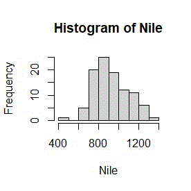
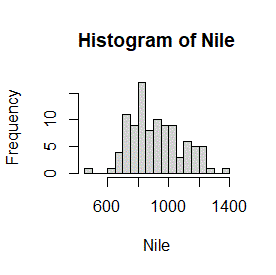
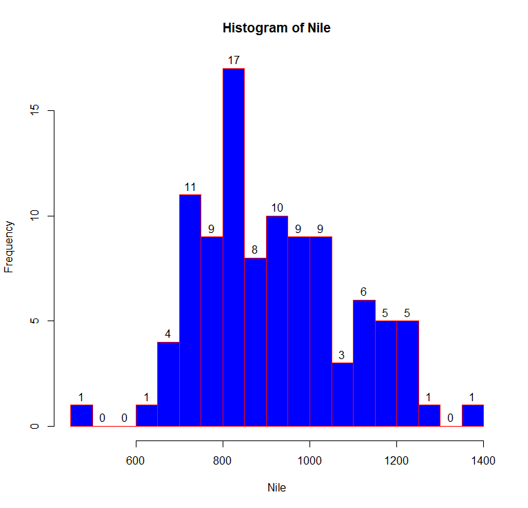

# Notes from fasteR

[fasteR](https://github.com/matloff/fasteR) di Norm Matloff

* [Lesson 2: First R Steps](#lesson-2-first-r-steps)
* [Lesson 3: Vectors and Indices](#lesson-3-vectors-and-indices)
* [Lesson 4: More on Vectors](#lesson-4-more-on-vectors)
* [Lesson 5: On to Data Frames!](#lesson-5-on-to-data-frames)
* [Lesson 6: The R Factor Class]
* [Lesson 7: Extracting Rows/Columns from Data Frames]
* [Lesson 8: More Examples of Extracting Rows, Columns]
* [Lesson 9: The tapply Function]
* [Lesson 10: Data Cleaning]

---

## Lesson 2: First R Steps

~~~
> 1+1
[1] 2
~~~

**Nile** is a buil-in dataset, specifically a time series **vector**.

~~~
> Nile
Time Series:
Start = 1871 
End = 1970 
Frequency = 1 
  [1] 1120 1160  963 1210 1160 1160  813 1230 1370 1140  995  935 1110  994 1020  960 1180
 [18]  799  958 1140 1100 1210 1150 1250 1260 1220 1030 1100  774  840  874  694  940  833
 [35]  701  916  692 1020 1050  969  831  726  456  824  702 1120 1100  832  764  821  768
 [52]  845  864  862  698  845  744  796 1040  759  781  865  845  944  984  897  822 1010
 [69]  771  676  649  846  812  742  801 1040  860  874  848  890  744  749  838 1050  918
 [86]  986  797  923  975  815 1020  906  901 1170  912  746  919  718  714  740
~~~

To get the **mean** of this serie:

```
> mean(Nile)
[1] 919.35
```

Lets graph Nile:

`hist(Nile)`




**MY TURN**

`hist(Nile, breaks=20)`



`hist(Nile, breaks=20, col='blue', border='red', labels=TRUE)`



---

## Lesson 3: Vectors and Indices

Access vector elements:

```
> Nile[5]
[1] 1160
> Nile[50]
[1] 821
Nile[98:100]
[1] 718 714 740
```

The mean of the last 2 years:

```
> mean(Nile[99:100])
[1] 727
```

Assignment:

```
> lasttwo <- Nile[99:100]
> lasttwo
[1] 714 740

> mean(lasttwo)
[1] 727
> sd(lasttwo)
[1] 18.38478
```

**MY TURN**

Find the mean over the years 1945-1960.

```
> newNile <- Nile[75:90]
> mean(newNile)
[1] 881.75
> length(newNile)
[1] 16
```

---

## Lesson 4: More on Vectors

The **sum** function

```
> sum(5,6,7)
[1] 18
> v<-c(5,5,5)
> sum(v)
[1] 15
```

Find the sum of the first 25 elements in Nile:

```
> sum(Nile[1:25])
[1] 27387
```

Continuing along the Nile, say we would like to know in how many years the level exceeded 1200.

```
> Nile > 1200
Time Series:
Start = 1871 
End = 1970 
Frequency = 1 
  [1] FALSE FALSE FALSE  TRUE FALSE FALSE FALSE  TRUE  TRUE FALSE FALSE FALSE
 [13] FALSE FALSE FALSE FALSE FALSE FALSE FALSE FALSE FALSE  TRUE FALSE  TRUE
 [25]  TRUE  TRUE FALSE FALSE FALSE FALSE FALSE FALSE FALSE FALSE FALSE FALSE
 [37] FALSE FALSE FALSE FALSE FALSE FALSE FALSE FALSE FALSE FALSE FALSE FALSE
 [49] FALSE FALSE FALSE FALSE FALSE FALSE FALSE FALSE FALSE FALSE FALSE FALSE
 [61] FALSE FALSE FALSE FALSE FALSE FALSE FALSE FALSE FALSE FALSE FALSE FALSE
 [73] FALSE FALSE FALSE FALSE FALSE FALSE FALSE FALSE FALSE FALSE FALSE FALSE
 [85] FALSE FALSE FALSE FALSE FALSE FALSE FALSE FALSE FALSE FALSE FALSE FALSE
 [97] FALSE FALSE FALSE FALSE

> sum(Nile > 1200)
[1] 7
```

Another example with ages:

```
> age<-c(18,14,15,21,32)

> age>18
[1] FALSE FALSE FALSE  TRUE  TRUE
> age>=18
[1]  TRUE FALSE FALSE  TRUE  TRUE
> sum(age>=18)
[1] 3
```

The **which** function:

```
> which(Nile > 1200)
[1]  4  8  9 22 24 25 26

> v<-which(Nile>1200)
> Nile[v]
[1] 1210 1230 1370 1210 1250 1260 1220

> Nile
Time Series:
Start = 1871 
End = 1970 
Frequency = 1 
  [1] 1120 1160  963 1210 1160 1160  813 1230 1370 1140  995  935 1110  994
 [15] 1020  960 1180  799  958 1140 1100 1210 1150 1250 1260 1220 1030 1100
 [29]  774  840  874  694  940  833  701  916  692 1020 1050  969  831  726
 [43]  456  824  702 1120 1100  832  764  821  768  845  864  862  698  845
 [57]  744  796 1040  759  781  865  845  944  984  897  822 1010  771  676
 [71]  649  846  812  742  801 1040  860  874  848  890  744  749  838 1050
 [85]  918  986  797  923  975  815 1020  906  901 1170  912  746  919  718
 [99]  714  740
```

Combining... WOW!

```
> Nile[Nile > 1200]
[1] 1210 1230 1370 1210 1250 1260 1220
```

Having fun with indexes:

```
> x<-c(5,10,15,20)

> x[-1]
[1] 10 15 20
> x[-4]
[1]  5 10 15
> x[c(-1,-4)]
[1] 10 15
```

## Lesson 5: On to Data Frames!

The **data frame** is a rectangular table consisting of one row for each data point. Say we have height, weight and age on each of 100 people. Our data frame would have 100 rows and 3 columns.

The **nrow** function (return the number of rows):

```
> nrow(ToothGrowth)
[1] 60
```

The **lenght** function (get the length of vectors):
```
> length(ToothGrowth$len)
[1] 60
```

The **head** function works on data frame:

```
> head(ToothGrowth)
   len supp dose
1  4.2   VC  0.5
2 11.5   VC  0.5
3  7.3   VC  0.5
4  5.8   VC  0.5
5  6.4   VC  0.5
6 10.0   VC  0.5

> head(ToothGrowth, 2)
   len supp dose
1  4.2   VC  0.5
2 11.5   VC  0.5
```

and also with vectors:
```
> head(tg$len)
[1]  4.2 11.5  7.3  5.8  6.4 10.0
```

The **tail** function:
```
> tail(ToothGrowth, 1)
   len supp dose
60  23   OJ    2
```

Dollar signs are used to denote the individual columns:
```
> tg$len
 [1]  4.2 11.5  7.3  5.8  6.4 10.0 11.2 11.2  5.2  7.0 16.5 16.5 15.2 17.3 22.5 17.3 13.6
[18] 14.5 18.8 15.5 23.6 18.5 33.9 25.5 26.4 32.5 26.7 21.5 23.3 29.5 15.2 21.5 17.6  9.7
[35] 14.5 10.0  8.2  9.4 16.5  9.7 19.7 23.3 23.6 26.4 20.0 25.2 25.8 21.2 14.5 27.3 25.5
[52] 26.4 22.4 24.5 24.8 30.9 26.4 27.3 29.4 23.0

> mean(tg$len)
[1] 18.81333
```

Retrive elements and rows:

```
> tg[60,]
   len supp dose
60  23   OJ    2

> tg$len[60]
[1] 23

> tg[60,1]
[1] 23
```

Mixing up:
```
> z<-tg[2:5,c(1,3)]
> z
   len dose
2 11.5  0.5
3  7.3  0.5
4  5.8  0.5
5  6.4  0.5
```

Create a data frame with **data.frame** function:
```
> x<-c(5,10,15)
> y<-c('a','b','c')

> d<-data.frame(x,y)

> d
   x y
1  5 a
2 10 b
3 15 c
```

**MY TURN**

Find the number of cases in which the tooth length was less than 16.
```
> tg<-ToothGrowth
> sum(tg$len < 16)
[1] 22
> sum(tg[1] < 16)
[1] 22
```

---

## Lesson 6: R Factor Class

Factors are used when we have *categorical* variables.

```
> class(ToothGrowth)
[1] "data.frame"

> class(ToothGrowth$supp)
[1] "factor"

> levels(ToothGrowth$supp)
[1] "OJ" "VC"
```

We see that there are two categories (levels), OJ/VC.

## Lesson 7: Extracting Rows/Columns from Data Frames

We saw how to extract vector elements:

```
> which(Nile>1200)
[1]  4  8  9 22 24 25 26
> Nile[which(Nile>1200)]
[1] 1210 1230 1370 1210 1250 1260 1220
```

Let's compare mean tooth length for the two types of supplements (*ToothGrowth*):

```
> tg<-ToothGrowth

# OJ rows
> suppOJ <- which(tg$sup == 'OJ')

# Indexes of tg where supp is OJ
> suppOJ
 [1] 31 32 33 34 35 36 37 38 39 40 41 42 43 44 45 46 47 48 49 50 51 52 53 54 55 56 57 58 59
[30] 60

# Mean of tooth length (first element in tg), given the indexes where supp is OJ
> mean(tg[suppOJ,1])
[1] 20.66333

# Similarly
> suppVC <- which(tg$supp == 'VC')
> mean(tg[suppVC,1])
[1] 16.96333
```

**MY TURN**

Find the number of eruptions for which the waiting time was more than 80 minutes (faithful).

```
> sum(faithful$waiting > 80)
[1] 84
```