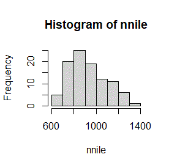
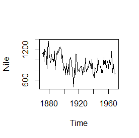
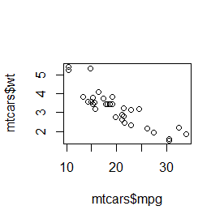
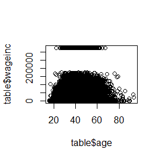
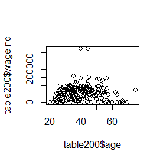
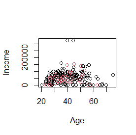
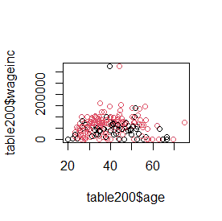
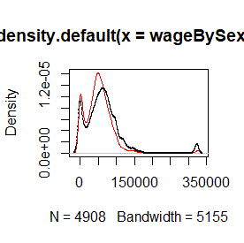
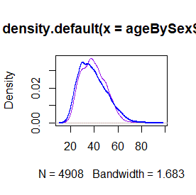

# Notes from fasteR

The following are my notes and exercises from the Norm Matloff's R course.

[fasteR](https://github.com/matloff/fasteR) - Norm Matloff

* [Lesson 2: First R Steps](#lesson-2-first-r-steps)
* [Lesson 3: Vectors and Indices](#lesson-3-vectors-and-indices)
* [Lesson 4: More on Vectors](#lesson-4-more-on-vectors)
* [Lesson 5: On to Data Frames!](#lesson-5-on-to-data-frames)
* [Lesson 6: The R Factor Class](#lesson-6-r-factor-class)
* [Lesson 7: Extracting Rows/Columns from Data Frames](#lesson-7-extracting-rowscolumns-from-data-frames)
* [Lesson 8: More Examples of Extracting Rows, Columns](#lesson-8-more-examples-of-extracting-rows-columns)
* [Lesson 9: The tapply Function](#lesson-9-the-tapply-function)
* [Lesson 10: Data Cleaning](#lesson-10-data-cleaning)
* [Lesson 11: The R List Class](#lesson-11-the-r-list-class)
* [Lesson 12: Another Look at the Nile Data](#lesson-12-another-look-at-the-nile-data)
* [Lesson 14: Introduction to Base R Graphics]()
* [Lesson 15: More on Base Graphics]()
* [Lesson 16: Writing Your Own Functions]()
* [Lesson 17: For Loops]()
* [Lesson 18: Functions with Blocks]()
* [Lesson 19: Text Editing and IDes]()
* [Lesson 20: If, Else, Ifelse]()
* [Lesson 21: Do Pro Athletes Keep Fit?]()
* [Lesson 22: Linear Regression Analysis, I]()
* [Lesson 23: S3 Classes]()
* [Lesson 24: Baseball Player Analysis (cont'd.)]()
* [Lesson 25: R Packages, CRAN, Etc.]()

---

## Lesson 2: First R Steps

~~~
> 1+1
[1] 2
~~~

**Nile** is a buil-in dataset, specifically a time series **vector**.

~~~
> Nile
Time Series:
Start = 1871 
End = 1970 
Frequency = 1 
  [1] 1120 1160  963 1210 1160 1160  813 1230 1370 1140  995  935 1110  994 1020  960 1180
 [18]  799  958 1140 1100 1210 1150 1250 1260 1220 1030 1100  774  840  874  694  940  833
 [35]  701  916  692 1020 1050  969  831  726  456  824  702 1120 1100  832  764  821  768
 [52]  845  864  862  698  845  744  796 1040  759  781  865  845  944  984  897  822 1010
 [69]  771  676  649  846  812  742  801 1040  860  874  848  890  744  749  838 1050  918
 [86]  986  797  923  975  815 1020  906  901 1170  912  746  919  718  714  740
~~~

To get the **mean** of this serie:

```
> mean(Nile)
[1] 919.35
```

Lets graph Nile:

`hist(Nile)`


**MY TURN**

`hist(Nile, breaks=20)`


`hist(Nile, breaks=20, col='blue', border='red', labels=TRUE)`


---

## Lesson 3: Vectors and Indices

Access vector elements:

```
> Nile[5]
[1] 1160
> Nile[50]
[1] 821
Nile[98:100]
[1] 718 714 740
```

The mean of the last 2 years:

```
> mean(Nile[99:100])
[1] 727
```

Assignment:

```
> lasttwo <- Nile[99:100]
> lasttwo
[1] 714 740

> mean(lasttwo)
[1] 727
> sd(lasttwo)
[1] 18.38478
```

**MY TURN**

Find the mean over the years 1945-1960.

```
> newNile <- Nile[75:90]
> mean(newNile)
[1] 881.75
> length(newNile)
[1] 16
```

---

## Lesson 4: More on Vectors

The **sum** function

```
> sum(5,6,7)
[1] 18
> v<-c(5,5,5)
> sum(v)
[1] 15
```

Find the sum of the first 25 elements in Nile:

```
> sum(Nile[1:25])
[1] 27387
```

Continuing along the Nile, say we would like to know in how many years the level exceeded 1200.

```
> Nile > 1200
Time Series:
Start = 1871 
End = 1970 
Frequency = 1 
  [1] FALSE FALSE FALSE  TRUE FALSE FALSE FALSE  TRUE  TRUE FALSE FALSE FALSE
 [13] FALSE FALSE FALSE FALSE FALSE FALSE FALSE FALSE FALSE  TRUE FALSE  TRUE
 [25]  TRUE  TRUE FALSE FALSE FALSE FALSE FALSE FALSE FALSE FALSE FALSE FALSE
 [37] FALSE FALSE FALSE FALSE FALSE FALSE FALSE FALSE FALSE FALSE FALSE FALSE
 [49] FALSE FALSE FALSE FALSE FALSE FALSE FALSE FALSE FALSE FALSE FALSE FALSE
 [61] FALSE FALSE FALSE FALSE FALSE FALSE FALSE FALSE FALSE FALSE FALSE FALSE
 [73] FALSE FALSE FALSE FALSE FALSE FALSE FALSE FALSE FALSE FALSE FALSE FALSE
 [85] FALSE FALSE FALSE FALSE FALSE FALSE FALSE FALSE FALSE FALSE FALSE FALSE
 [97] FALSE FALSE FALSE FALSE

> sum(Nile > 1200)
[1] 7
```

Another example with ages:

```
> age<-c(18,14,15,21,32)

> age>18
[1] FALSE FALSE FALSE  TRUE  TRUE
> age>=18
[1]  TRUE FALSE FALSE  TRUE  TRUE
> sum(age>=18)
[1] 3
```

The **which** function:

```
> which(Nile > 1200)
[1]  4  8  9 22 24 25 26

> v<-which(Nile>1200)
> Nile[v]
[1] 1210 1230 1370 1210 1250 1260 1220

> Nile
Time Series:
Start = 1871 
End = 1970 
Frequency = 1 
  [1] 1120 1160  963 1210 1160 1160  813 1230 1370 1140  995  935 1110  994
 [15] 1020  960 1180  799  958 1140 1100 1210 1150 1250 1260 1220 1030 1100
 [29]  774  840  874  694  940  833  701  916  692 1020 1050  969  831  726
 [43]  456  824  702 1120 1100  832  764  821  768  845  864  862  698  845
 [57]  744  796 1040  759  781  865  845  944  984  897  822 1010  771  676
 [71]  649  846  812  742  801 1040  860  874  848  890  744  749  838 1050
 [85]  918  986  797  923  975  815 1020  906  901 1170  912  746  919  718
 [99]  714  740
```

Combining... WOW!

```
> Nile[Nile > 1200]
[1] 1210 1230 1370 1210 1250 1260 1220
```

Having fun with indexes:

```
> x<-c(5,10,15,20)

> x[-1]
[1] 10 15 20
> x[-4]
[1]  5 10 15
> x[c(-1,-4)]
[1] 10 15
```

## Lesson 5: On to Data Frames!

The **data frame** is a rectangular table consisting of one row for each data point. Say we have height, weight and age on each of 100 people. Our data frame would have 100 rows and 3 columns.

The **nrow** function (return the number of rows):

```
> nrow(ToothGrowth)
[1] 60
```

The **lenght** function (get the length of vectors):
```
> length(ToothGrowth$len)
[1] 60
```

The **head** function works on data frame:

```
> head(ToothGrowth)
   len supp dose
1  4.2   VC  0.5
2 11.5   VC  0.5
3  7.3   VC  0.5
4  5.8   VC  0.5
5  6.4   VC  0.5
6 10.0   VC  0.5

> head(ToothGrowth, 2)
   len supp dose
1  4.2   VC  0.5
2 11.5   VC  0.5
```

and also with vectors:
```
> head(tg$len)
[1]  4.2 11.5  7.3  5.8  6.4 10.0
```

The **tail** function:
```
> tail(ToothGrowth, 1)
   len supp dose
60  23   OJ    2
```

Dollar signs are used to denote the individual columns:
```
> tg$len
 [1]  4.2 11.5  7.3  5.8  6.4 10.0 11.2 11.2  5.2  7.0 16.5 16.5 15.2 17.3 22.5 17.3 13.6
[18] 14.5 18.8 15.5 23.6 18.5 33.9 25.5 26.4 32.5 26.7 21.5 23.3 29.5 15.2 21.5 17.6  9.7
[35] 14.5 10.0  8.2  9.4 16.5  9.7 19.7 23.3 23.6 26.4 20.0 25.2 25.8 21.2 14.5 27.3 25.5
[52] 26.4 22.4 24.5 24.8 30.9 26.4 27.3 29.4 23.0

> mean(tg$len)
[1] 18.81333
```

Retrive elements and rows:

```
> tg[60,]
   len supp dose
60  23   OJ    2

> tg$len[60]
[1] 23

> tg[60,1]
[1] 23
```

Mixing up:
```
> z<-tg[2:5,c(1,3)]
> z
   len dose
2 11.5  0.5
3  7.3  0.5
4  5.8  0.5
5  6.4  0.5
```

Create a data frame with **data.frame** function:
```
> x<-c(5,10,15)
> y<-c('a','b','c')

> d<-data.frame(x,y)

> d
   x y
1  5 a
2 10 b
3 15 c
```

**MY TURN**

Find the number of cases in which the tooth length was less than 16.
```
> tg<-ToothGrowth
> sum(tg$len < 16)
[1] 22
> sum(tg[1] < 16)
[1] 22
```

---

## Lesson 6: R Factor Class

Factors are used when we have *categorical* variables.

```
> class(ToothGrowth)
[1] "data.frame"

> class(ToothGrowth$supp)
[1] "factor"

> levels(ToothGrowth$supp)
[1] "OJ" "VC"
```

We see that there are two categories (levels), OJ/VC.

## Lesson 7: Extracting Rows/Columns from Data Frames

We saw how to extract vector elements:

```
> which(Nile>1200)
[1]  4  8  9 22 24 25 26
> Nile[which(Nile>1200)]
[1] 1210 1230 1370 1210 1250 1260 1220
```

Let's compare mean tooth length for the two types of supplements (*ToothGrowth*):

```
> tg<-ToothGrowth

# OJ rows
> suppOJ <- which(tg$sup == 'OJ')

# Indexes of tg where supp is OJ
> suppOJ
 [1] 31 32 33 34 35 36 37 38 39 40 41 42 43 44 45 46 47 48 49 50 51 52 53 54 55 56 57 58 59
[30] 60

# Mean of tooth length (first element in tg), given the indexes where supp is OJ
> mean(tg[suppOJ,1])
[1] 20.66333

# Similarly
> suppVC <- which(tg$supp == 'VC')
> mean(tg[suppVC,1])
[1] 16.96333
```

**MY TURN**

Find the number of eruptions for which the waiting time was more than 80 minutes (faithful).

```
> sum(faithful$waiting > 80)
[1] 84
```
## Lesson 8: More Examples of Extracting Rows, Columns

**AND** (&) operator

Say we wish to extract from tg the sub-data frame consisting of OJ AND length less than 8.8:

```
> subtg <- tg[tg$supp=='OJ' & tg$len<8.8,] # Retrive the rows with ... AND ...
> subtg
   len supp dose
37 8.2   OJ  0.5
```

**OR** (|) operator

Say we want to obtain all rows in which either len is greater than 28 OR the treatment dose was 1.0 or both:

```
> subtg <- tg[tg$len>28 | tg$dose==1.0,]

> nrow(subtg)
[1] 25
```

Extracting columns from a data frame:

```
> smallertg <- tg[,c(1,3)] # Specifying columns by index

> head(smallertg)
   len dose
1  4.2  0.5
2 11.5  0.5
3  7.3  0.5
4  5.8  0.5
5  6.4  0.5
6 10.0  0.5

> lendose <- tg[,c('len','dose')] # Specifying columns by name

> head(lendose)
   len dose
1  4.2  0.5
2 11.5  0.5
3  7.3  0.5
4  5.8  0.5
5  6.4  0.5
6 10.0  0.5
```
The *logical operations* work on vectors too. For example, say in the Nile data we wish to know how many years had flows in the extremes, say below 800 or above 1300:

```
> length(Nile[Nile<800 | Nile>1300])
[1] 27
```

**MY TURN**

Find the number of eruptions for which 'eruptions' was greater than 3 and waiting time was more than 80 minutes (faithful).

```
> nrow(faithful[faithful$eruptions>3 & faithful$waiting>80,]) # Gimme the rows where ... AND ...
[1] 84
```

## Lesson 9: The tapply Function

**tapply** function: apply a function to each cell of a ragged array.

tapply(X, INDEX, ...)

* X: an R object for which a split method exists. Typically vector-like
* INDEX: a list of one or more factors.

```
> head(tg)
   len supp dose
1  4.2   VC  0.5
2 11.5   VC  0.5
3  7.3   VC  0.5
4  5.8   VC  0.5
5  6.4   VC  0.5
6 10.0   VC  0.5

> tapply(tg$len, tg$supp, mean) # Given the factors in tg$supp, calculate the tooth mean of the grousp
      OJ       VC 
20.66333 16.96333
```
Another example for **tapply**:

```
> age <- c(5,8,10,15)
> sex <- c('M','F','M','F')

> tapply(age, sex, mean) # Calculate the mean age for F and M
   F    M 
11.5  7.5
```

Another example for **tapply**:
```
# PlantGrowth is a data frame, with weight and group as columns

> tapply(PlantGrowth$weight, PlantGrowth$group, length) # Gimme how many weight data we have for each group
ctrl trt1 trt2 
  10   10   10 # Of course, because PlantGrowth is a data frame and it has to have same lenght columns, we have the same number of weight mesures for each group.
```

**MY TURN**

One of the most famous built-in R datasets is mtcars, which has various measurements on cars from the 60s and 70s.

```
> head(mtcars)
                   mpg cyl disp  hp drat    wt  qsec vs am gear carb
Mazda RX4         21.0   6  160 110 3.90 2.620 16.46  0  1    4    4
Mazda RX4 Wag     21.0   6  160 110 3.90 2.875 17.02  0  1    4    4
Datsun 710        22.8   4  108  93 3.85 2.320 18.61  1  1    4    1
Hornet 4 Drive    21.4   6  258 110 3.08 3.215 19.44  1  0    3    1
Hornet Sportabout 18.7   8  360 175 3.15 3.440 17.02  0  0    3    2
Valiant           18.1   6  225 105 2.76 3.460 20.22  1  0    3    1
```

Are the car names a column? NO!
```
> head(mtcars[,1])
[1] 21.0 21.0 22.8 21.4 18.7 18.1
```

So, what are the names in the data frame? The name of the rows:
```
> head(row.names(mtcars)) # row.names: Get and Set Row Names for Data Frames
[1] "Mazda RX4"         "Mazda RX4 Wag"     "Datsun 710"        "Hornet 4 Drive"   
[5] "Hornet Sportabout" "Valiant"
```

You may wish to start by comparing the mean miles-per-gallon values for 4-, 6- and 8-cylinder cars.

```
> tapply(mtcars$mpg, mtcars$cyl, mean) # Data: mpg, Factors(groups):cyl, Function: mean
       4        6        8 
26.66364 19.74286 15.10000 # WOW!
```

Another suggestion would be to find how many cars there are in each cylinder category, using tapply.
```
> tapply(mtcars$mpg, mtcars$cyl, length) # Data: any measure, Groups: cyl, Function: lenght (of the data vector)
 4  6  8 
11  7 14
```

Find the mean horsepower for 6-cylinder cars.
```
> mean(mtcars[mtcars$cyl==6, 'hp']) # Mean of the column HP, where cylinder==6
[1] 122.2857
```
## Lesson 10: Data Cleaning

The **read** function: reads a file in table format and creates a data frame from it.

```
> pima <- read.csv("http://heather.cs.ucdavis.edu/FasteR/data/Pima.csv", header=TRUE)

> head(pima)
  pregnant glucose diastolic triceps insulin  bmi diabetes age test
1        6     148        72      35       0 33.6    0.627  50    1
2        1      85        66      29       0 26.6    0.351  31    0
3        8     183        64       0       0 23.3    0.672  32    1
4        1      89        66      23      94 28.1    0.167  21    0
5        0     137        40      35     168 43.1    2.288  33    1
6        5     116        74       0       0 25.6    0.201  30    0

> nrow(pima)
[1] 768
```

The **table** function: build a contingency table.

```
> table(pima$glucose)

  0  44  56  57  61  62  65  67  68  71  72  73  74  75  76  77  78  79  80  81  82  83  84 
  5   1   1   2   1   1   1   1   3   4   1   3   4   2   2   2   4   3   6   6   3   6  10 
 85  86  87  88  89  90  91  92  93  94  95  96  97  98  99 100 101 102 103 104 105 106 107 
  7   3   7   9   6  11   9   9   7   7  13   8   9   3  17  17   9  13   9   6  13  14  11 
108 109 110 111 112 113 114 115 116 117 118 119 120 121 122 123 124 125 126 127 128 129 130 
 13  12   6  14  13   5  11  10   7  11   6  11  11   6  12   9  11  14   9   5  11  14   7 
131 132 133 134 135 136 137 138 139 140 141 142 143 144 145 146 147 148 149 150 151 152 153 
  5   5   5   6   4   8   8   5   8   5   5   5   6   7   5   9   7   4   1   3   6   4   2 
154 155 156 157 158 159 160 161 162 163 164 165 166 167 168 169 170 171 172 173 174 175 176 
  6   5   3   2   8   2   1   3   6   3   3   4   3   3   4   1   2   3   1   6   2   2   2 
177 178 179 180 181 182 183 184 186 187 188 189 190 191 193 194 195 196 197 198 199 
  1   1   5   5   5   1   3   3   1   4   2   4   1   1   2   3   2   3   4   1   1 
```

Let's consider a version of the glucose data that at least excludes these 0s.
```
> data <- pima[pima$glucose>0,]

# OR

> data <- which(data$glucose>0)
```

Rather than removing the 0s, it's better to recode them as NAs.
```
# Before
> pima[pima$glucose==0,]
    pregnant glucose diastolic triceps insulin  bmi diabetes age test
76         1       0        48      20       0 24.7    0.140  22    0
183        1       0        74      20      23 27.7    0.299  21    0
343        1       0        68      35       0 32.0    0.389  22    0
350        5       0        80      32       0 41.0    0.346  37    1
503        6       0        68      41       0 39.0    0.727  41    1

> pima$glucose[pima$glucose==0] <- NA

#After
> pima[is.na(pima$glucose),]
    pregnant glucose diastolic triceps insulin  bmi diabetes age test
76         1      NA        48      20       0 24.7    0.140  22    0
183        1      NA        74      20      23 27.7    0.299  21    0
343        1      NA        68      35       0 32.0    0.389  22    0
350        5      NA        80      32       0 41.0    0.346  37    1
503        6      NA        68      41       0 39.0    0.727  41    1

> sum(is.na(pima$glucose))
[1] 5
```

By default, the mean function will not skip over NA values; thus the mean was reported as NA too. But we can instruct the function to skip the NAs:
```
# Before
> mean(pima$glucose)
[1] NA

# After
> mean(pima$glucose, na.rm=TRUE)
[1] 121.6868
```

**MY TURN**

1) Determine which other columns in pima have suspicious 0s, and replace them with NA values.

The dataset contains the following variables:

* pregnant: Number of times pregnant
* glucose: Plasma glucose concentration at 2 hours in an oral glucose tolerance test &rarr; 0 = NA
* diastolic: Diastolic blood pressure (mm Hg) &rarr; 0 = NA
* triceps: Triceps skin fold thickness (mm) &rarr; 0 = NA
* insulin: 2-Hour serum insulin (mu U/ml)
* bmi: Body mass index (weight in kg/(height in metres squared)) &rarr; 0 = NA
* diabetes:Diabetes pedigree function
* age: Age (years)
* test: test whether the patient shows signs of diabetes (coded 0 if negative, 1 if positive)

```
> pima$diastolic[pima$diastolic==0] <- NA
> pima$triceps[pima$triceps==0] <- NA
> pima$bmi[pima$bmi==0] <- NA

> mean(pima$bmi, na.rm=TRUE)
[1] 32.45746
```

2) Look again at the plot we made earlier of the Nile flow histogram. There seems to be a gap between the numbers at the low end and the rest.


A) What years did these correspond to?

```
# Index of years with Nile<600
> index <- which(Nile<600)
> index
[1] 43 # only 1 year

# 1871 base year + index - 1
> 1871+index-1
[1] 1913
```

B) Find the mean of the data, excluding these cases.

```
> nnile<-Nile
> nnile[nnile<600]<-NA

> mean(nnile)
[1] NA
> mean(nnile, na.rm=TRUE)
[1] 924.0303
> mean(Nile)
[1] 919.35

> hist(nnile)
```



## Lesson 11: The R List Class

The **split** function: divides the data in the vector into the groups defined.

```
> mt <- split(mtcars, mtcars$cyl)

> mtl <- split(mtcars$mpg, mtcars$cyl)
> mtl$`4`
 [1] 22.8 24.4 22.8 32.4 30.4 33.9 21.5 27.3 26.0 30.4 21.4
> mtl[[1]]
 [1] 22.8 24.4 22.8 32.4 30.4 33.9 21.5 27.3 26.0 30.4 21.4

 > class(mtl)
[1] "list"
```

Lists are especially good for mixing types together in one package:
```
> l <- list(c(1:5), c("sky","sea"))
> l
[[1]]
[1] 1 2 3 4 5

[[2]]
[1] "sky" "sea"

> list <- list(a = c(1:3), b = "blue")
> list
$a
[1] 1 2 3

$b
[1] "blue"
```

What if we want, say, the MPG for the third car in the 6-cylinder category?

```
> mtl[[2]][3]
[1] 21.4
```

**MY TURN**

Try using split on the ToothGrowth data, say splitting into groups according to the supplement, and finding various quantities.

```
> tg <- split(ToothGrowth$len, ToothGrowth$supp)

> tg
$OJ
 [1] 15.2 21.5 17.6  9.7 14.5 10.0  8.2  9.4 16.5  9.7 19.7 23.3 23.6 26.4 20.0 25.2 25.8
[18] 21.2 14.5 27.3 25.5 26.4 22.4 24.5 24.8 30.9 26.4 27.3 29.4 23.0

$VC
 [1]  4.2 11.5  7.3  5.8  6.4 10.0 11.2 11.2  5.2  7.0 16.5 16.5 15.2 17.3 22.5 17.3 13.6
[18] 14.5 18.8 15.5 23.6 18.5 33.9 25.5 26.4 32.5 26.7 21.5 23.3 29.5

> mean(tg$`OJ`)
[1] 20.66333

> length(tg$`OJ`)
[1] 30

> mean(tg[[2]])
[1] 16.96333

> length(tg[[2]])
[1] 30

```

If we don't like those default names, we can change them:
`> names(mtl) <- c('four','six','eight')`


## Lesson 12: Another Look at the Nile Data

`> plot(Nile)`



```
> which(Nile < 600)
[1] 43
```

`> plot(mtcars$mpg, mtcars$wt)`



**MY TURN**

There appear to be some unusually high values as well, e.g. one around 1875. Determine which year this was.

```
> Nile[Nile>1200]
[1] 1210 1230 1370 1210 1250 1260 1220

> y <- which(Nile>1300)

> 1871+y-1
[1] 1879
```
## Lesson 14: Introduction to Base R Graphics

The **read.table** function: reads a file in table format and creates a data frame from it.

```
> table <- read.table("https://raw.githubusercontent.com/matloff/fasteR/master/data/prgeng.txt", header=TRUE)

> head(table)
       age educ occ sex wageinc wkswrkd
1 50.30082   13 102   2   75000      52
2 41.10139    9 101   1   12300      20
3 24.67374    9 102   2   15400      52

> plot(table$age, table$wageinc)
```



Oh no, the dreaded Black Screen Problem! There are about 20,000 data points, thus filling certain parts of the screen. So, let's just plot a random sample, say 200.

The **sample** function: takes a sample of the specified size from the elements of x &rarr; sample(x, size, ...)

```
# Random sample of size 200 from the range 1:20.000 
> index <- sample(1:nrow(table), 200)

# New table with 200 rows
> table200 <- table[index,]

# New plot
> plot(table200$age, table200$wageinc)
```



We can break things down by gender, via color coding:

```
> plot(table200$age, table200$wageinc, col=as.factor(table200$sex), xlab="Age", ylab="Income")
```



Note that pe200$sex is a numeric vector, but *col* requires an R factor; the function **as.factor** does the conversion.

**MY TURN**

Try some scatter plots on various datasets. I suggest first using the above data with wage against age again, but this time color-coding by education level. (By the way, 1-9 codes no college; 10-12 means some college; 13 is a bachelor's degree, 14 a master's, 15 a professional degree and 16 is a doctorate.)

```
# Red: people with at least a BSc
> plot(table200$age, table200$wageinc, col=as.factor(table200$educ>12))
```



## Lesson 15: More on Base Graphics

First we use split to separate the data by gender:

```
> wageBySex <- split(table$wageinc, table$sex)

> dm <- density(wageBySex$`1`)
> dw <- density(wageBySex$`2`)

> plot(dw, col="red") # Women red
> points(dm,cex=0.2)
```



Why did we call the **points** function instead of plot in that second line? The issue is that calling plot again would destroy the first plot; we merely want to add points to the existing graph.

**MY TURN**

Try plotting multiple such curves on the same graph, for other data.

```
# Split Age by Sex
> ageBySex <- split(table$age, table$sex)

# Distribution for Age
> dw <- density(ageBySex$`2`)
> dm <- density(ageBySex$`1`)

> plot(dw, col="purple")
> points(dm, col="blue", cex=0.2)
```

